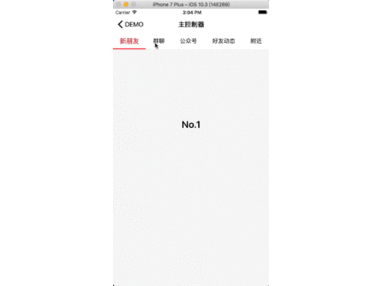

# MenuComponent

[](https://raw.githubusercontent.com/dexianyinjiu/MenuComponent/master/LICENSE)&nbsp;
[](https://cocoapods.org/pods/MenuComponent)&nbsp;
[](https://cocoapods.org/pods/MenuComponent)&nbsp;

多功能滑动菜单，实现各控制器的滚动展示，支持点击、左右滑动以及分级。

# Usage



## CocoaPods

1. `pod 'MenuComponent', '~> 1.0'`;
2. `pod install` / `pod update`;
3. `#import <MenuComponent/MenuTabBarController.h>`.

## Example

本组件，包含：`MenuTabBarController`和`MenuTabBar`，两者均可单独使用。其中`MenuTabBarController`通过使用`addChildViewController`将各子控制器加在同一父控制器中，通过点击菜单按钮或滑动，实现各子控制器的切换。部分UI可通过以下属性自行设置。

顶部菜单类型:

```objc
typedef enum {
    MenuTabBarTypeNormal = 0,   //同级：仅有文字，宽度由文字决定
    MenuTabBarTypeAverage,      //同级：仅有文字，宽度均分
    MenuTabBarTypeArrow,        //分级：可逐级点击
    MenuTabBarTypeImage         //同级：图在上文字在下，宽度均分

} MenuTabBarType;
```

`MenuTabBarController`属性：
  
```objc
//代理
@property (nonatomic,assign) id<MenuTabBarControllerDelegate> delegate;
//类型
@property (nonatomic,assign) MenuTabBarType tabBarType;
//子控制器是否可以滑动
@property (nonatomic,assign) BOOL scrollEnabled;
//点击切换是否有滚动动画
@property (nonatomic,assign) BOOL scrollAnimation;
//点击切换文字是否变大
@property (nonatomic,assign) BOOL enlargeEnabled;
//字体
@property (nonatomic,strong) UIFont *font;
//标签颜色
@property (nonatomic,strong) UIColor *indicatorColor;
//被选中标签的颜色
@property (nonatomic,strong) UIColor *currentIndicatorColor;
//标示线颜色
@property (nonatomic,strong) UIColor *indicatorLineColor;
//文字数组
@property (nonatomic,strong) NSArray *titleArray;
//图片数组
@property (nonatomic,strong) NSArray *imageArray;
//子控制器数组
@property (nonatomic,strong) NSArray *subViewControllers;
//当前选择的Index
@property (nonatomic,assign,readonly) NSInteger currentIndex;

//### 外部接口

//更新菜单
- (void)updateData;
//设置父控制器
- (void)setParentController:(UIViewController *)viewController;
```

具体使用如下：

```objc
MenuTabBarController *tabBarController = [[MenuTabBarController alloc] init];
tabBarController.tabBarType = MenuTabBarTypeImage;
tabBarController.delegate = self;
tabBarController.scrollEnabled = NO;
tabBarController.scrollAnimation = NO;
tabBarController.font = [UIFont systemFontOfSize:15.0];
tabBarController.indicatorColor = [UIColor blackColor];
tabBarController.currentIndicatorColor = [UIColor redColor];
tabBarController.indicatorLineColor = [UIColor redColor];
tabBarController.titleArray = @[@"新朋友",@"群聊",@"公众号"];
tabBarController.imageArray = @[[UIImage imageNamed:@"item_0"],[UIImage imageNamed:@"item_1"],[UIImage imageNamed:@"item_2"]];
tabBarController.subViewControllers = @[firstVC,seconVC,thirdVC];
[tabBarController setParentController:self];

#pragma mark - MenuTabBarControllerDelegate
- (void)tabBarController:(MenuTabBarController *)tabBarController didSelectAtIndex:(NSInteger)index
{
    NSLog(@"点击Index：%d",index);
}
```

# Requirements

This library requires `iOS 7.0+` and `Xcode 7.0+`.


# License

MenuComponent is provided under the MIT license. See LICENSE file for details.


